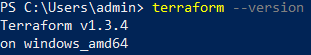

# Домашнее задание к занятию "7.1. Инфраструктура как код"
1. 
   1. Предлагаю использовать неизменяемый тип инфраструктуры для возможности её релизации при помощи packer, terraform и ansible.
   2. Как таковой необходимости в центральном сервере для управления инфраструктурой не вижу. Как вариант можно использовать AWX или Ansible Tower для предоставления доступа команде разработки к некоторым Ansible сценариям.
   3. Ansible не требует установки агентов, так что агентов не будет.
   4. Как писал в первом пункте, предлагаю использовать packer для создания образов ВМ, Terraform для развёртывания и Ansible для конфигурирования. Само разрабатываемое ПО запускать в Kubernetes т.к. разработчики уже используют Docker.
   
   Предлагаю использовать следующие инструменты:
   * Packer - удобен для создания образов ВМ для облака.
   * Terraform - для развёртывания инфраструктуры в облаке.
   * Ansible - для последующей конфигурации и для автоматизации рутинных задач по обслуживанию инфраструктуры. Также возможно использование AWX или Ansible Tower для предоставления доступа команде разработки к запуску некоторых Ansible сценариев.
   * Docker - для сборки образов контейнеров с разрабатываемым ПО.
   * Kubernetes - для запуска контейнеров с ПО.
   * GitLab - для хранения кода и CI/CD.

2. Установленный terraform:  
   
3. Две разные версии Terraform:  
   